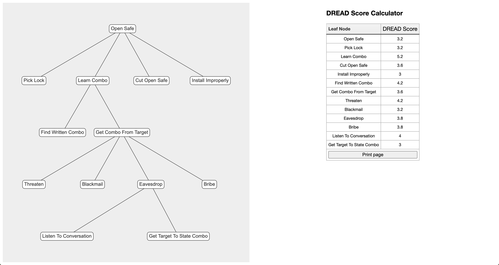

# Attack Tree DREAD Calculator

Attack Tree DREAD Calculator, short ATDC, is a Python application for generating, i.e. visualising attack trees and calculating the DREAD score for each node (leaf) in the attack tree.

It takes a JSON file as input, which needs a specific structure for the app to work successfully. The structure is as follows:

```
{
  "nodes": [
    {
      "id": "id",
      "name": "name",
    }
  ],
  "edges": [
    {
      "from": "from",
      "to": "to",
    }
  ]
}
```
The input file, i.e. the JSON file, is the basis for the visualisation, i.e., the attack tree specification.

This application relies heavily on utilising the pyvis library, which aims to build a python-based approach to constructing and visualising network graphs in the same space (pyvis.readthedocs.io, n.d.).

ATDC was inspired by Suraksha, which is a workbench for security designers intended to be embedded into the system from the very early stages of Software Development Life Cycle (SDLC)(Maurya et al., 2009).

This application applies the same methodology (DREAD) for calculating the risk associated with a node as Suraksha, meaning that a user can select the appropriate value (between 1 and 10) for each DREAD category of a single node: Damage Potential (D), Reproducibility (R), Exploitability (E), Affected Users (A) and Discoverability (D).

Once all values have been entered, a user receives a risk score for each node based on the following formula:
```
Risk = (D + R + E + A + D) / 5
```
The calculation always produces a number between 0 and 10; the higher the number, the more serious the risk (Maurya et al., 2009).

## Installation

#### 1. Clone repository
Clone the repository from [GitHub](https://github.com/savanovic-essex/attack-tree-dread-calculator) to access the project.

#### 2. Set up a virtual environment
*If you use a modern IDE, such as PyCharm, the programme will automatically ask you to set up a virtual environment and do the rest. You only have to select the Python version. Once you do, it will set up the venv, active it and afterwards install the dependencies from the reqirements.txt file.*

Once you have downloaded it, please navigate to the folder in which you have saved it and set up a virtual Python environment.
**!! Make sure to use Python 2.7 !!**

Suppose the system does not automatically assign the venv to your project. In that case, you will need to use different syntax for activating the virtual environment depending on which operating system and command shell you’re using (Yegulalp, 2022).

On Unix or macOS, using the bash shell:
```bash
source /path/to/venv/bin/activate
```
On Windows, using the command prompt: 
```
path\to\venv\Scripts\activate.bat
```

#### 3. Install dependencies
Now that you have set up a virtual Python environment for this project, you can start to install the dependencies. Make sure that you are located in the root folder of the project. To install the dependencies, execute the following command in the root folder.
```bash
pip install -r requirements.txt
```

Great! You are now ready to start using the Attack Tree DREAD Calculator App.

## Usage

#### Python
The ATDC App takes two inputs from a user and produces one output file. The first input is the file path to the JSON file containing the attack tree specification, and the second is the name for the output file produced by the ATDC app.


To start the app, navigate to the project's root folder (in your terminal/console) and execute the following command:

```bash
python main.py
```

This command will start the application, and you will be presented with the following screen:

```
================================
Attack Tree DREAD Calculator App
================================
You will have to input a JSON file and name the output file, which will automatically open in your browser.

1. Enter the file's location: [file location, e.g. attack_tree.json]
2. Enter the output file's name: [output file's name, e.g. attack_tree_result]
```

Once you have entered the required inputs, the app will automatically start a browser and open the output file. From this moment on, the Python part of the app has finished executing.

#### JavaScript / HTML / Browser
Now that you find yourself in the internet browser, you will see the generated attack tree on the left side of the screen and the DREAD score calculator on the right side. This table will be populated by the attack tree's node (leaf) values. For each node, there will be the option to enter the DREAD values (1-10).

The following action you can undertake is changing the default values of 1 for each node (DREAD categories) and adapting them to your liking.

Once you have done that, click on the "Calculate DREAD score" button, and a new table will be generated with DREAD scores for each node, which can be seen in the example below:


Figure 1.

## Linter output
```
(venv) djordjesavanovic@Djordjes-MacBook-Pro attack-tree-dread-calculator-new % pylint main.py
No config file found, using default configuration

-------------------------------------------------------------------
Your code has been rated at 10.00/10 (previous run: 9.68/10, +0.32)

```

Figure 2.

## Demonstration of Application
For the demonstration of the ATDC application, I will use a demo attack tree from the Henriksen(2018) article on utilising draw.io for generating attack trees.


Figure 3: An attack tree exploring how to open a safe. (Henriksen, 2018)

First, a user needs to create the attack tree specification. In this case, that file can be found in the root folder of this project - it is called ```attack_tree.json```.

Secondly, a user needs to start the app by typing in the following command:
```bash
python main.py
```

Figure 4.

Once the app runs, users must type the file path to the attack tree specification.


Figure 5.

Secondly, they need to enter the name of the output file:

Figure 6.

Thirdly, they need to press enter and wait for the browser window to open, where they will be presented with the screen, as seen in Figure 1.

Once they are in the browser window they can enter values for each DREAD category of each node and press the "Calculate DREAD risk" button.
They should end up with something like this:

Figure 7.

## References
Henriksen, M. (2018) Draw.io for threat modelling. Michael Henriksen - Freelance Security Engineer & Consultant. Available from: https://michenriksen.com/blog/drawio-for-threat-modeling/ [Accessed 13 October 2022].

Maurya, S., Jangam, E., Talukder, M. & Pais, A.R. (2009) 'Suraksha: A security designers’ workbench',  Hack.in. National Institute of Technology Karnataka, Kanpur, 17-19 March 2009. 59–66.

pyvis.readthedocs.io. (n.d.) Introduction — pyvis 0.1.3.1 documentation. Available from: https://pyvis.readthedocs.io/en/latest/introduction.html [Accessed 10 October 2022].

Yegulalp, S. (2022) Virtualenv and venv: Python virtual environments explained. InfoWorld. Available from: https://www.infoworld.com/article/3239675/virtualenv-and-venv-python-virtual-environments-explained.html [Accessed 26 October 2022].